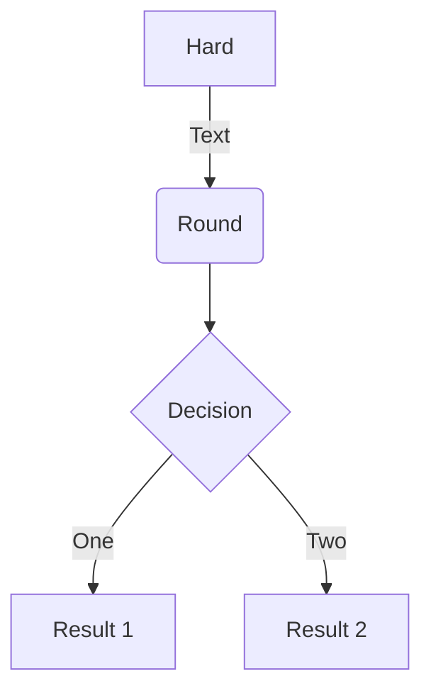

# Diagrams

TODO

- <https://github.com/fcannizzaro/mkdocs-sequence-js-plugin>
- <https://pypi.org/project/mkdocs-build-plantuml-plugin/>

## Mermaid2

Reference: <https://github.com/fralau/mkdocs-mermaid2-plugin>

!!! important
    Mermaid2 can't be used with `pymdownx.superfences`

### Install & Configure

```bash
pip3 i mkdocs-mermaid2-plugin
```

```yaml
plugins:
  - search
  - mermaid2

extra_javascript:
    - https://unpkg.com/mermaid/dist/mermaid.min.js
```

### Usage

Reference: <https://mermaid-js.github.io/mermaid/>

    ```mermaid
    graph TD
        A[Hard] -->|Text| B(Round)
        B --> C{Decision}
        C -->|One| D[Result 1]
        C -->|Two| E[Result 2]
    ```


