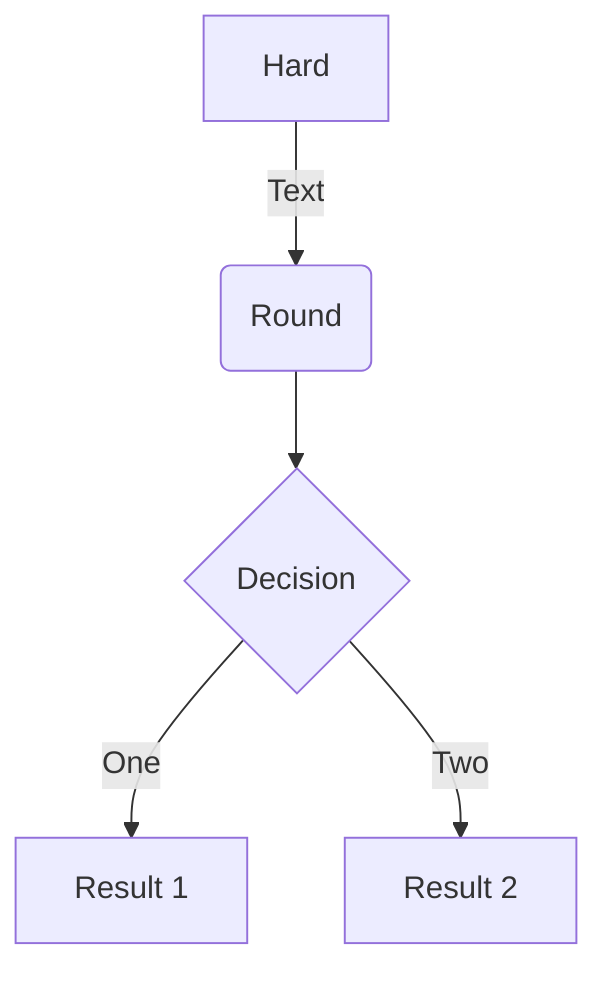

# Diagrams

TODO

- <https://github.com/gisce/markdown-blockdiag>
- <https://aafigure.readthedocs.io/en/latest/>
- <https://github.com/fcannizzaro/mkdocs-sequence-js-plugin>
- <https://github.com/christo-ph/mkdocs_build_plantuml>

## svgbob

- Reference: <https://pypi.org/project/markdown-svgbob/>
- Live demo: <https://ivanceras.github.io/svgbob-editor/>

### Install & Configure

```bash
pip3 install markdown-svgbob
```

```yaml
markdown_extensions:
  - markdown_svgbob:
      tag_type: inline_svg
      bg_color: white
      fg_color: black
      min_char_width: 80
```

Usage:

    ```bob
                      ,-.
                      `-'
                      /|\  User
                       |
                      / \
                       |
              ,--------+--------.
             /                   \
            /                     \
           v                       v
    +-------------+          +--------------+            +-------------+
    |   Client    |<-------->|   Server     |<---------->| Platform    |
    +-------------+          +--------------+            +-------------+
                                                         | Security    |
                                                         +-------------+
    ```


```bob
                  ,-.
                  `-'
                  /|\  User
                   |
                  / \
                   |
          ,--------+--------.
         /                   \
        /                     \
       v                       v
+-------------+          +--------------+            +-------------+
|   Client    |<-------->|   Server     |<---------->| Platform    |
+-------------+          +--------------+            +-------------+
                                                     | Security    |
                                                     +-------------+
```

- Pros: Text-only, easy to learn
- Cons: No colours (only in CLI version)


## Mermaid2

Reference: <https://github.com/fralau/mkdocs-mermaid2-plugin>

!!! important
    Mermaid2 can't be used with `pymdownx.superfences`

### Install & Configure

```bash
pip3 i mkdocs-mermaid2-plugin
```

```yaml
plugins:
  - search
  - mermaid2

extra_javascript:
    - https://unpkg.com/mermaid/dist/mermaid.min.js
```

### Usage

Reference: <https://mermaid-js.github.io/mermaid/>

    ```mermaid
    graph TD
        A[Hard] -->|Text| B(Round)
        B --> C{Decision}
        C -->|One| D[Result 1]
        C -->|Two| E[Result 2]
    ```


